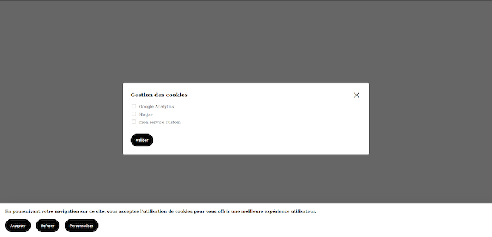

# Tarte à la praline - User cookie management

<a href="https://www.npmjs.com/package/@novaway/tarte-a-la-praline"></a>
<a href="https://npmcharts.com/compare/@novaway/tarte-a-la-praline?minimal=true"></a>
<a href="https://david-dm.org/novaway/tarte-a-la-praline" title="dependencies status"></a>

_**Tarte à la praline**_ is a lightweight library that allow users to manage tracking cookies in a way that is compliant with the european [Directive 2009/136/EC](https://eur-lex.europa.eu/LexUriServ/LexUriServ.do?uri=OJ:L:2009:337:0011:0036:en:PDF) also refered to as _"The cookie Law"_.



_Tarte à la praline_ is quite opinionated to ensure its lightness. If you are looking for a more complete implementation, we recommand you use [tarteaucitron.js](https://github.com/AmauriC/tarteaucitron.js).

## Features

-   Native configuration for Google Analytics and Hotjar
-   Ability to add custom configuration for other trackers
-   Color customisation (more advenced styling options to come)
-   HTML classes customisation
-   i18n management

🔷 Writen in TypeScript

## Install

Install the package using NPM or your favorite package manager :

```
npm i @novaway/tarte-a-la-praline
```

Then import the module in your application :

```
import '@novaway/tarte-a-la-praline/translations/en';
import initTALP from '@novaway/tarte-a-la-praline';
```

## Basic Usage

**Example**

```
import '@novaway/tarte-a-la-praline/translations/en';
import initTALP from '@novaway/tarte-a-la-praline';

initTALP({
  codeGa: string,
  codeHj: string
})
```

[More examples with all features](./example/EXAMPLE.md).

## Browser compatibility

To be tested

## Development

If you want to modify this library, you can run it with the following command.

```
npm start
```

You can also build it in a production compatible way.

```
npm run build-prod
```

### Testing

TODO

## TODO

-   [x] Translations module
-   [ ] a11y
-   [ ] Adding possibility to customize default CSS
-   [ ] Zero dependencies
-   [ ] Verify browser compatibility
-   [ ] Tests

## Contributing

If you want to contribute to this project, please refer to our [Contributing Guidelines](CONTRIBUTING.md)

Made in 🦁 with 🌰 and sugar
